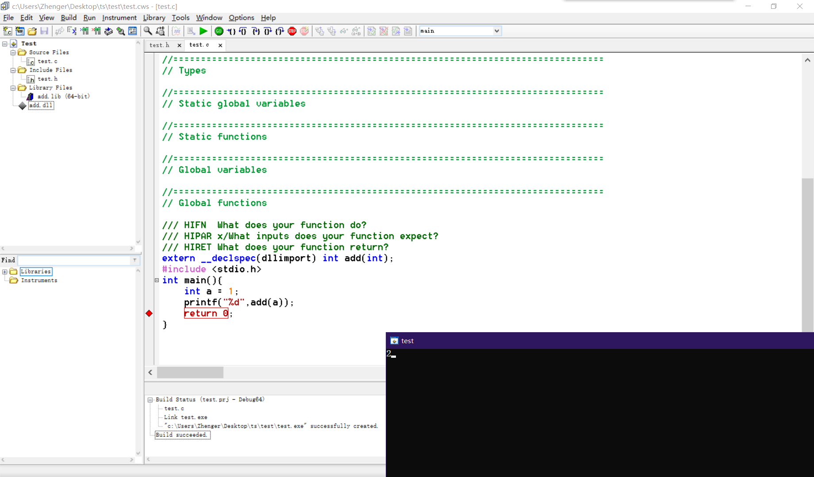
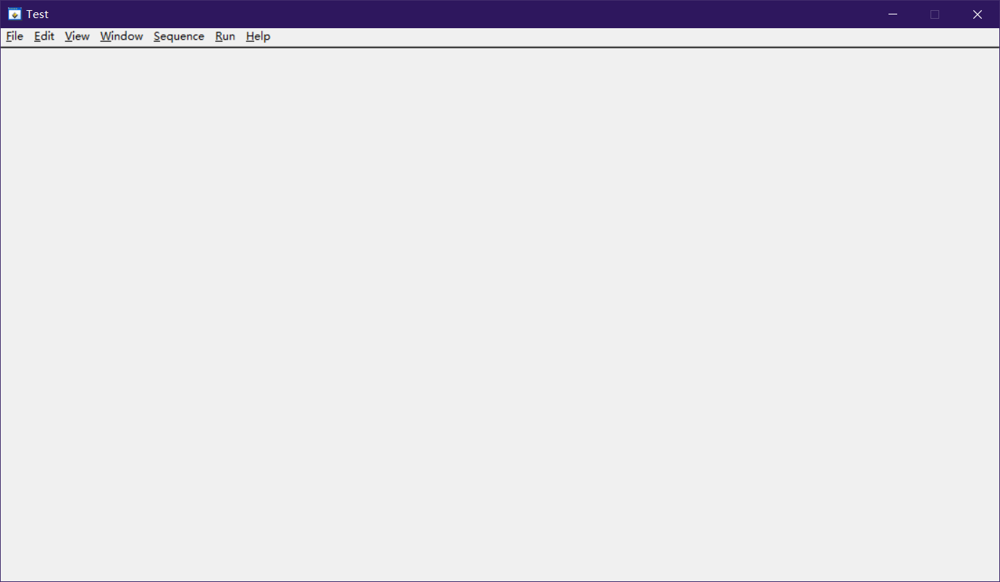

what did i do

#### C++用 clang 生成 dll 并用 cvi 调用：

add.cpp 内容：

```cpp
#include "add.h"

__declspec(dllexport) int __stdcall add(int x) {
    return x+1;
}
```

add.h 内容：

```cpp
#ifndef __MYDLL_H__
#define __MYDLL_H__

#ifdef __cplusplus
extern "C" {
#endif
    __declspec(dllexport) int __stdcall add(int x);
#ifdef __cplusplus
}
#endif

#endif // __MYDLL_H__
```

用 clang 生成dll：

```bash
clang++ -c add.cpp
clang++ add.o -shared -fPIC -o add.dll
```

就可以得到 add.lib 和 add.dll 了，把这两个文件放到cvi目录下就可以了。

测试 cvi 工程的 test.c：

```c
extern __declspec(dllimport) int add(int);
#include <stdio.h>
int main(){
	int a=1;
	printf("%d",add(a));
	return 0;
}
```

结果是可行的



#### 增加菜单栏：

找到官方例程里的 menudemo.cws，右击 uir 空白地方选择 edit 添加菜单栏，现在是画了个壳，还没有增加回调。


